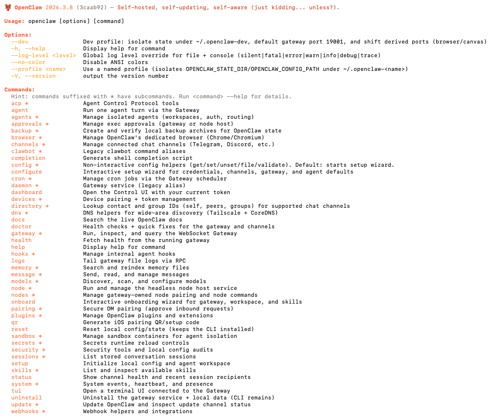

# 第 4 章：安装、初始化与运行路径

> **这一章解决什么问题？**
> 你已经建立了 OpenClaw 的概念认知（第 1-2 章）和安全观（第 3 章）。现在是时候动手了——安装软件、启动 Gateway、跑通第一条命令、看到第一次输出。
> 但"动手"不等于"蒙着眼睛照着命令敲"。这一章的写法和你可能见过的"安装教程"不同：每一步操作之前都会先告诉你"这一步在系统里意味着什么"，操作之后都会告诉你"怎么验证这一步成功了"以及"如果失败了该看哪里"。
> 这一章的目标很单一也很硬：**走完这一章后，你的终端里应该有一个活着的 Gateway，并且你已经成功完成了至少一次 Agent Turn 拿到了输出。** 只要这条生命线通了，后续所有章节的学习都有了可验证的基础。
> 如果你在这一章卡住了，不要跳到后面去。后面所有章节的操作都依赖这一章建立的运行环境。

### 本章核心命令速查

本章会出现不少命令，但**现阶段你真正需要掌握的只有以下几条**。其他命令在文中出现时只是为了说明概念或给出备选方案，不需要你现在就记住。

| 命令                                     | 作用                                                         | 优先级   |
| :--------------------------------------- | :----------------------------------------------------------- | :------- |
| `npm install -g openclaw@latest`         | 安装 / 升级 OpenClaw                                         | **必须** |
| `openclaw onboard`                       | 一站式初始化配置（加 `--install-daemon` 可同时安装后台服务） | **必须** |
| `openclaw gateway --verbose`             | 前台启动 Gateway（学习阶段推荐）                             | **必须** |
| `openclaw doctor`                        | 全面诊断——出问题时第一个跑的命令                             | **必须** |
| `openclaw --dev <子命令>`                | 在隔离的 dev 环境中运行（家目录 `~/.openclaw-dev/`）         | 推荐     |
| `openclaw --version` / `openclaw --help` | 查看版本 / 帮助信息                                          | 了解     |

> 下面正文中每次出现这些命令时，都会说明它在整体流程中的位置。如果你在某一节看到了其他命令（如 `message send`、`channels login`、`gateway --force` 等），那些是**后续章节的内容**——第 5 章（命令行总览）会系统地介绍它们，现在可以跳过。

---

## 4.1 安装前的环境确认

### 4.1.1 在你敲第一行安装命令之前

安装 OpenClaw 本身只有一行命令，但如果你的环境不满足前置条件，这一行命令要么报错、要么装完了也跑不起来。所以我们先花两分钟确认环境。

**你需要的前置条件：**

| 条件                              | 验证方法           | 说明                                                         |
| :-------------------------------- | :----------------- | :----------------------------------------------------------- |
| macOS 或 Linux（Windows 需 WSL2） | `uname -s`         | 本文档以 macOS 为主，Linux 步骤基本相同；Windows 用户强烈推荐使用 WSL2 |
| **Node.js ≥ 22**                  | `node --version`   | OpenClaw 要求 Node 22 或更高版本                             |
| npm / pnpm / bun（任选其一）      | `npm --version`    | npm 随 Node.js 安装；也支持 pnpm 或 bun                      |
| Git（可选，推荐）                 | `git --version`    | 用于版本控制你的配置文件                                     |
| Docker（可选，后续章节需要）      | `docker --version` | 第 8 章 Sandbox 才需要，现在不装也行                         |

**逐一检查：**

```bash
# 1. 操作系统
uname -s
# 预期输出：Darwin（macOS）或 Linux

# 2. Node.js 版本——注意最低要求是 22
node --version
# 预期输出：v22.x.x 或更高

# 3. 包管理器（任选一个能用即可）
npm --version
# 或：pnpm --version
# 或：bun --version
```

**如果 Node.js 没装或版本低于 22：**

macOS 推荐用 Homebrew 安装：

```bash
# 安装 Homebrew（如果还没有）
/bin/bash -c "$(curl -fsSL https://raw.githubusercontent.com/Homebrew/install/HEAD/install.sh)"

# 安装 Node.js 22
brew install node@22

# 安装完成后验证
node --version
npm --version
```

如果你用 `nvm`（Node Version Manager）管理 Node.js 版本，执行 `nvm install 22 && nvm use 22` 即可。

> **提醒：OpenClaw 明确要求 Node ≥ 22。如果你用的是 Node 18 或 20，虽然可能不会在安装时报错，但运行时可能出现兼容性问题。请升级到 22。**

---

## 4.2 安装 OpenClaw

### 4.2.1 一行命令安装

OpenClaw 通过 npm（或 pnpm）全局安装：

```bash
npm install -g openclaw@latest
# 或者用 pnpm：
# pnpm add -g openclaw@latest
```

这行命令做了三件事：

1. 从 npm 仓库下载 `openclaw` 包及其所有依赖
   1. 将 `openclaw` 可执行文件安装到你的全局 npm bin 目录（Apple Silicon Mac 通常是 /opt/homebrew/bin/openclaw，Intel Mac 通常是 `/usr/local/bin/openclaw`）
2. 让你可以在任何目录下直接运行 `openclaw` 命令

> **注意包名：** npm 上的包名就是 `openclaw`（不是 `@anthropic-ai/claw` 或其他名字）。OpenClaw 是一个由 Peter Steinberger 和社区维护的开源项目（MIT 许可），不隶属于任何特定的模型提供商。

### 4.2.2 安装后立刻验证

安装完成后，不要急着做下一步。先验证安装是否成功：

```bash
# 确认 openclaw 命令可用
which openclaw
# 预期输出：一个路径，比如 /opt/homebrew/bin/openclaw（Apple Silicon Mac）
#           或 /usr/local/bin/openclaw（Intel Mac）

# 查看版本号
openclaw --version
# 预期输出：OpenClaw 2026.3.8 (3caab92)（版本号和 commit hash 因版本而异）

# 查看帮助信息
openclaw --help
# 预期输出：一份命令列表和用法说明
```

**如果 `which openclaw` 没有返回路径：**

这通常意味着全局 npm bin 目录不在你的 `$PATH` 中。排查步骤：

```bash
# 查看 npm 全局 bin 目录在哪
npm config get prefix
# Apple Silicon Mac 通常输出 /opt/homebrew，Intel Mac 通常输出 /usr/local

# 那么 openclaw 应该在对应的 bin/ 下
ls $(npm config get prefix)/bin/openclaw

# 如果文件存在但命令找不到，说明 PATH 有问题
echo $PATH | tr ':' '\n' | grep -i "npm\|local\/bin"
```

**最常见的修复方式（macOS）：** 在你的 `~/.zshrc` 或 `~/.bash_profile` 中确认有以下行（根据你的 Mac 芯片选择）：

```bash
# Apple Silicon Mac（M1/M2/M3/M4）
export PATH="/opt/homebrew/bin:$PATH"

# Intel Mac
export PATH="/usr/local/bin:$PATH"
```

修改后执行 `source ~/.zshrc` 使其生效。

### 4.2.3 `openclaw --help` 的输出值得仔细看一次

运行 `openclaw --help` 后，你会看到所有可用的子命令和选项。现在不需要记住它们——但请花 30 秒扫一遍，建立一个"大概有哪些命令"的整体印象。

你会注意到几个关键子命令：`onboard`、`gateway`、`agent`、`doctor` 等。下面的章节会逐一介绍它们。



### 4.2.4 版本更新

OpenClaw 更新频繁。当你需要升级到最新版本时：

```bash
npm install -g openclaw@latest
# 升级后运行诊断，确认没有兼容性问题
openclaw doctor
```

OpenClaw 还提供了内置的更新命令和版本通道（stable / beta / dev），详见[官方更新文档](https://docs.openclaw.ai/install/updating)。

---

## 4.3 安装后的系统目录和 Workspace 结构

> **阅读提示：** 本节介绍的目录结构会在你完成 `onboard`（4.4 节）之后才真正出现在磁盘上。如果你更喜欢"先跑通再回头看结构"，可以先跳到 4.4 节完成初始化，然后再回来阅读本节——不影响后续操作。

### 4.3.1 OpenClaw 在你的磁盘上创建了什么

安装完成后（特别是运行 `onboard` 之后），OpenClaw 会在你的 Home 目录下创建一个隐藏的配置目录。这个目录是 OpenClaw 的"大本营"——所有的配置文件、Agent 数据、凭据、会话历史、日志都存在这里。

```bash
# 查看 OpenClaw 的配置目录
ls -la ~/.openclaw/
```

典型的目录结构：

```
~/.openclaw/
├── openclaw.json         # 主配置文件（JSON 格式）
├── workspace/            # 工作空间目录（每个项目一个子目录）
├── memory/               # 记忆索引相关数据
├── agents/               # Agent 定义与配置
├── completions/          # 会话与补全历史记录
├── identity/             # 身份与凭据存储
├── cron/                 # 定时任务相关状态
├── canvas/               # 画布相关数据
├── devices/              # 设备相关信息
└── logs/                 # 日志文件
```

**你需要理解的核心概念是：** `~/.openclaw/` 就是 OpenClaw 的家。当你运行任何 `openclaw` 命令时，它都会回到这个目录来读配置、写日志、存数据。如果你删了这个目录，OpenClaw 的所有配置和历史数据都会消失（可执行文件还在，但需要重新初始化）。

**关键目录要记住：**

1. **`~/.openclaw/openclaw.json`** — 主配置文件。所有的模型设置、Gateway 参数、Channel 配置都在这里。
2. **`~/.openclaw/agents/`** — Agent 的定义与配置目录。
3. **`~/.openclaw/identity/`** — 身份与凭据存储（如 Channel 登录信息）。
4. **`~/.openclaw/completions/`** — 会话历史和补全记录。

### 4.3.2 `agents/` 目录与 Agent 配置

Agent 的定义和配置存储在 `~/.openclaw/agents/` 目录中。当你通过 `openclaw onboard` 或手动创建 Agent 时，相关的配置文件和提示文件会被放在这里。

`~/.openclaw/identity/` 目录则存储身份凭据——比如你连接 WhatsApp、Telegram 等 Channel 时的登录信息和 token。

`~/.openclaw/completions/` 目录存储会话历史——Agent 和你的对话记录、补全数据。

这些目录的内部结构和详细配置方法是第 6 章（Agent 设计方法论）的内容。现在你只需要知道它们存在、知道在哪里。

### 4.3.3 Profile——整套环境的隔离机制

OpenClaw 提供了 **Profile** 机制，用于隔离**整套状态与配置环境**。每个 Profile 对应一个独立的家目录，拥有自己的 `openclaw.json`、`agents/`、`identity/`、`completions/`、`logs/` 等全部数据——彼此完全互不干扰。

| 启动方式                             | 家目录                 | 说明                     |
| :----------------------------------- | :--------------------- | :----------------------- |
| `openclaw gateway`                   | `~/.openclaw/`         | 默认环境                 |
| `openclaw --dev gateway`             | `~/.openclaw-dev/`     | 内置的开发 / 实验环境    |
| `openclaw --profile staging gateway` | `~/.openclaw-staging/` | 自定义 Profile，名称任取 |

**典型用法：**

```bash
# 默认环境——日常使用
openclaw gateway

# dev 环境——学习、试错、破坏性实验（推荐学习阶段使用）
openclaw --dev gateway

# 自定义 profile——为特定项目或场景建立独立环境
openclaw --profile myproject gateway
```

> **`--dev` 和 `--profile` 是全局选项，放在子命令之前。** 它们会将所有读写操作重定向到对应的家目录。例如 `openclaw --dev onboard` 会在 `~/.openclaw-dev/` 下生成配置，与默认的 `~/.openclaw/` 完全隔离。

**Profile vs. Agent——两种不同层次的隔离：**

- **Profile** 隔离的是**整套运行环境**——配置文件、凭据、会话历史、日志、Gateway 实例。可以理解为"另一台独立的机器"。
- **Agent** 隔离的是**系统内部的执行角色**——同一个 Gateway 内可以运行多个 Agent，各自有不同的模型、提示词、工具集和 Workspace（第 6-7 章详细讲）。

两者不是二选一的关系：你可以在同一个 Profile 里运行多个 Agent，也可以用不同的 Profile 分别管理不同的 Agent 集合。

**学习阶段的建议：** 用 `--dev` 做所有实验。这样即使配置改坏了，也不影响默认环境。等到你对配置有信心后，再把成熟的配置迁移到默认环境中。

---

## 4.4 首次初始化：onboard 是你的起点

### 4.4.1 Onboard Wizard——一站式初始化

OpenClaw 的推荐初始化方式是运行 **onboard wizard**（引导式向导）。这是官方文档的首要推荐路径：

```bash
openclaw onboard --install-daemon
```

这一条命令做了很多事情：

1. 引导你完成 Gateway、Workspace、Channel（消息渠道）和 Skills（技能）的配置
2. 生成 `~/.openclaw/openclaw.json` 配置文件
3. **安装 Gateway 守护进程**（`--install-daemon`）：在 macOS 上注册一个 launchd 用户服务，在 Linux 上注册一个 systemd 用户服务，让 Gateway 在系统启动时自动运行


**类比理解：**

想象你搬进一套新房子：

- `openclaw onboard` = 物业带你走一圈，问你"空调要多少度？Wi-Fi 密码设什么？"——引导式填写所有关键参数，同时帮你把水电都通好（安装守护进程）

### 4.4.2 交互式 onboarding 的过程

当你运行 `openclaw onboard --install-daemon` 后，终端会进入交互模式，一步一步问你问题。以下是你可能遇到的典型步骤和建议：

**步骤 1：模型配置**

向导会问你使用哪个模型提供商以及你的 API Key 或 OAuth 登录信息。

**建议：**

- 如果你有 Anthropic（Claude）的 API Key → 选 Anthropic
- 如果你有 OpenAI 的 API Key 或 ChatGPT 订阅 → 选 OpenAI（支持 OAuth 登录）
- 如果你想零成本且已安装 Ollama → 选本地模型
- 如果你不确定 → 先选你已有 API Key / 订阅的那个，后续随时可以更改
- 国内用户可以考虑接入千问等国内模型提供商，有一定的免费额度。

> **关于模型选择的官方建议：** 为了获得最佳体验和降低 prompt injection 风险，官方推荐使用你能获得的最新最强的模型。但学习阶段用中档模型即可——重点是跑通流程。

**步骤 2：Gateway 设置**

向导会配置 Gateway 的监听地址和端口。OpenClaw 的默认端口是 **18789**（WebSocket 控制平面）。

**建议：接受默认值即可。**

**步骤 3：Channel 配置（可选）**

向导可能会问你是否要配置消息渠道（WhatsApp、Telegram 等）。**第一次初始化时跳过即可**——Channel 配置是第 10-11 章的内容，不要让它阻塞你的第一次成功运行。

**步骤 4：Daemon 安装**

加了 `--install-daemon` 后，向导会注册一个系统后台服务，让 Gateway 开机自动运行、关闭终端也不停止。

### 4.4.3 如果你不想安装 daemon

如果你更喜欢手动控制 Gateway 的启停（学习阶段这样做也完全合理），可以去掉 `--install-daemon`：

```bash
openclaw onboard
```

这种方式只做配置，不安装系统服务。Gateway 需要你手动启动（下一节会讲）。

### 4.4.4 onboarding 结束后立刻做这件事

onboarding 完成后，**不要急着跑任务**。先做一件事：去看一眼它帮你生成的配置文件。

```bash
# 查看主配置文件
cat ~/.openclaw/openclaw.json
```

**为什么要看这一眼？** 三个原因：

1. **你知道配置文件长什么样了。** 后续需要改任何参数时，你知道去哪改。注意它是**标准 JSON 格式**。
2. **你知道配置存在哪里。** `~/.openclaw/openclaw.json`——记住这个路径。
3. **你可以确认关键信息是否正确。** 比如 `gateway.auth` 中的认证信息是否生成了。

> **提示：** 虽然官方文档称配置文件为 JSON5 格式，但 `onboard` 生成的实际上是标准 JSON。手动编辑时建议按标准 JSON 来写，确保兼容性。

### 4.4.5 什么信息是 onboarding 阶段配好的

Onboarding 帮你填好了"不可或缺"的最小配置——没有这些信息，Gateway 无法正常工作：

- **Agent 默认参数** — `agents.defaults` 部分，包括并发限制（`maxConcurrent`）、上下文压缩模式（`compaction`）等运行时行为。
- **Gateway 认证** — `gateway.auth` 部分，生成了认证 token，用于客户端连接 Gateway 时的身份验证。
- **消息与命令配置** — `messages` 和 `commands` 部分的默认行为。

> **重要提醒：** `onboard` **不会**自动配置模型信息。
>
> - 如果 onboard 过程中未选择模型，你需要后续手动配置（见 4.6 节）

### 4.4.6 什么信息应该后续再补

Channel、自定义 Agent、Sandbox、Cron、Skills、Secrets、远程 Gateway 等配置都不需要在 onboarding 阶段搞定——各自在后续对应章节（第 6–17 章）中讲解。你现在的唯一目标是**启动 Gateway、跑通一次请求**。先打通这条路，以后每学一个新概念都可以在这个基础上验证。

### 4.4.7 日后维护配置：直接编辑 `openclaw.json`

初始化完成后，日后调整配置的方式就是直接编辑 `~/.openclaw/openclaw.json`。这是一个 JSON 文件，用你顺手的文本编辑器打开即可：

```bash
# 用 VS Code 编辑
code ~/.openclaw/openclaw.json

# 或用 vim
vim ~/.openclaw/openclaw.json

# 或用 nano
nano ~/.openclaw/openclaw.json
```

**常见的配置修改示例：**

假设你的配置文件原始内容是 onboard 生成的，你可以手动添加以下字段：

```json
{
  "agents": {
    "defaults": {
      "model": "anthropic/claude-opus-4-6"
    }
  },
  "gateway": {
    "mode": "local",
    "auth": {
      "mode": "token",
      "token": "你的认证token..."
    }
  }
}
```

> **编辑提示：** 你不需要从头写——只需在 onboard 生成的现有 JSON 中添加或修改对应字段。注意 JSON 格式：所有 key 必须用双引号包裹，最后一个元素后面不能有逗号。

修改配置后，需要重启 Gateway 使更改生效。完整的配置参考可以在[官方配置文档](https://docs.openclaw.ai/gateway/configuration)中找到。

---

## 4.5 启动 Gateway

### 4.5.1 什么是 Gateway，为什么必须先启动它

回顾第 2 章的概念：Gateway 是 OpenClaw 的**中枢控制平面**。它是一个 **WebSocket 服务**（默认监听 `ws://127.0.0.1:18789`），所有的客户端——CLI、WebChat UI、macOS 应用、iOS/Android 节点——都通过这个 WebSocket 连接到 Gateway。

它不是一个"敲一下就结束"的命令——它是一个**持续运行的进程**。所有的 Agent 请求都要经过 Gateway；没有活着的 Gateway，任何操作都无法执行。

把 Gateway 类比为一台路由器：你家里所有设备要上网，都得先连上路由器。Gateway 就是 OpenClaw 世界里的路由器——你必须先让它运行起来。

### 4.5.2 第一次启动 Gateway

**如果你在 onboard 时用了 `--install-daemon`：**

Gateway 已经作为系统服务在后台运行了。你可以跳到 4.5.4 的健康检查步骤直接验证。

**如果你没有安装 daemon，手动启动：**

```bash
openclaw gateway --verbose
```

> **`--verbose` 会输出详细日志**——学习阶段建议始终加上，方便观察 Gateway 在做什么。等配置成熟后可以去掉。

> **首次启动可能遇到 "Gateway start blocked" 错误：** 如果你看到类似 `Gateway start blocked: set gateway.mode=local (current: unset) or pass --allow-unconfigured` 的提示，说明配置文件中还没有设置 Gateway 模式。解决方法二选一：
>
> **方法一（推荐）：在配置文件中设置 Gateway 模式**
>
> ```bash
> # 编辑 ~/.openclaw/openclaw.json，在 gateway 部分添加 "mode": "local"
> ```
>
> 找到 `"gateway"` 部分，添加 `"mode": "local"`：
>
> ```json
> "gateway": {
>  "mode": "local",
>  "auth": {
>    "mode": "token",
>    "token": "你的token..."
>  }
> }
> ```
>
> **方法二（快速跳过）：加 `--allow-unconfigured` 标志**
>
> ```bash
> openclaw gateway --verbose --allow-unconfigured
> ```
>
> 学习阶段推荐方法一——把配置写进文件，一劳永逸。

这行命令做了什么：

1. 读取 `~/.openclaw/openclaw.json` 配置
2. 验证配置是否合法
3. 启动 WebSocket 控制平面
4. 连接配置的模型提供商
5. 启动 Control UI（Web 界面）
6. 在终端持续输出运行日志

**关键行为：Gateway 启动后会"占住"你的终端。** 你会看到日志不断刷出来。这是正常的——它是一个持续运行的进程。

你有两种选择：

**选择 A：前台运行（推荐学习阶段使用）**

就是上面的命令。Gateway 运行在当前终端的前台，日志实时显示。好处是你能直接看到系统在做什么——当你在另一个终端发起 Agent 请求时，这个终端会实时显示处理过程。

要停止 Gateway，按 `Ctrl-C`。

**选择 B：作为系统服务运行（推荐日常使用）**

如果你希望 Gateway 一直在后台运行（即使关闭终端也不停止），可以用 daemon 模式：

```bash
openclaw onboard --install-daemon
```

安装 daemon 后，Gateway 通过系统服务管理（macOS 的 launchd / Linux 的 systemd）自动启动和维护。

### 4.5.3 如何判断 Gateway 启动成功了

成功启动后，你应该看到类似这样的日志输出（具体格式因版本而异）：

```
🦞 OpenClaw 2026.3.8 (3caab92) — Your .zshrc wishes it could do what I do.

HH:MM:SS Gateway listening on ws://127.0.0.1:18789
HH:MM:SS Control UI available at http://127.0.0.1:18789
```

> **关于启动横幅：** OpenClaw 启动时会显示一只龙虾 emoji（🦞，吉祥物 Molty）、版本号和一句随机的幽默标语。这是正常行为——说明 OpenClaw 可执行文件已加载成功。

**关键检查点：**

1. **没有 ERROR 级别的日志。** 如果有 WARN 可以先忽略，ERROR 则需要处理。
2. **看到 "listening on" 或 "is ready" 意味着 Gateway 已就绪。** 注意默认端口是 **18789**。
3. **模型信息正确。** 确认日志中显示的 model 是你在 onboarding 中选的。

### 4.5.4 启动后立刻做健康检查

**打开一个新的终端窗口**（如果 Gateway 在前台运行的话），运行 `doctor`：

```bash
openclaw doctor
```

`doctor` 是 OpenClaw 的**全面诊断工具**。它不像简单的 "ping" 检查——它会扫描：

- Gateway 进程是否在运行
- 配置文件是否有语法错误
- 模型连接是否正常
- 版本兼容性
- 潜在的安全配置问题（比如 DM 策略是否暴露了风险）
- 依赖是否满足

如果所有检查都通过，你会看到一系列成功信息。如果有问题，`doctor` 会告诉你具体哪里不对以及建议的修复方式。

> **学习阶段的建议：** 每次修改配置或升级版本后，都跑一次 `openclaw doctor`。这个习惯会帮你在问题变复杂之前就发现它们。

### 4.5.5 Gateway 的核心运维操作

```
openclaw gateway               → 前台启动（加 --verbose 可看详细日志）
openclaw onboard --install-daemon  → 安装为系统服务（后台自动运行）
openclaw doctor                → 全面诊断
openclaw gateway stop         → 停止 Gateway（如果是前台运行，直接 Ctrl-C；如果是 daemon，执行这个命令）
```

**其他有用的操作：**

```bash
# 如果 Gateway 以 daemon 方式运行，查看其日志
# 日志目录在 ~/.openclaw/logs/ 下
ls ~/.openclaw/logs/
# 你会看到 config-audit.jsonl 等日志文件
tail -f ~/.openclaw/logs/*.log

# 如果 Gateway 以前台方式运行，日志直接在终端中显示

# 停止前台运行的 Gateway
# 在 Gateway 终端中按 Ctrl-C
```

### 4.5.6 关于 Control UI

Gateway 启动后，它会同时提供一个 **Control UI**（Web 界面），你可以在浏览器中访问：

```
http://127.0.0.1:18789
```

Control UI 提供了：

- WebChat 界面——可以直接在浏览器中和 Agent 对话
- 会话管理
- 状态监控

学习阶段你主要会用 CLI 和 WebChat 两种方式与 Agent 交互。WebChat 是最直观的新手验证方式，CLI 更适合自动化，会在后续章节继续展开讲解。

---

## 4.6 模型配置基础

### 4.6.1 模型在 OpenClaw 中的角色

回顾第 2 章：Agent 是 OpenClaw 中实际执行任务的工作单元，而 Agent 的"大脑"是模型（LLM）。当 Agent 收到一个消息时，它使用模型来"思考"应该如何回复、是否需要调用工具、按什么顺序操作。

所以模型配置的实质是：**告诉 OpenClaw "Agent 的大脑用哪个模型"。**

在 `openclaw.json` 中，模型配置的格式是 `"提供商/模型名"`：

```json
{
  "agents": {
    "defaults": {
      "model": "anthropic/claude-opus-4-6"
    }
  }
}
```

### 4.6.2 初始模型配置建议

现阶段你只需要一个能跑通的模型。但提前了解一个设计原则会有帮助：**不同复杂度的任务应该匹配不同档次的模型**——简单任务用小模型省钱、复杂任务才上强模型。OpenClaw 支持为不同 Agent 配置不同模型，实现模型级别的"按需分配"。

模型配置不是一次性决策，随时可以修改 `openclaw.json` 来切换。多模型混合策略详见第 6 章。

---

## 4.7 第一次成功运行的最小闭环

### 4.7.1 目标

走完以下五个步骤，且每一步都成功：

```
① 确认 Gateway 运行  →  ② 发起一次 Agent 消息  →  ③ 拿到结果  →  ④ 看日志  →  ⑤ 看到失败长什么样
```

走完这五步，你的"第一条生命线"就通了。

### 4.7.2 步骤一：确认 Gateway 正在运行

如果你在 onboard 时安装了 daemon，Gateway 应该已经在后台运行了。如果你选择手动启动：

```bash
# 终端 1：启动 Gateway（前台运行，保持这个终端开着）
openclaw gateway --verbose
```

验证：

```bash
# 终端 2：运行诊断
openclaw doctor
# 预期输出：各项检查通过
```

### 4.7.3 步骤二：发起第一次 Agent 消息

在浏览器中打开 Control UI：

```
http://127.0.0.1:18789
```

在 WebChat 界面的输入框中输入一条简单的消息：

```
请用一句话回答：2 + 3 等于多少？
```

> 这一步的目的不是验证模型的能力——是验证"Gateway → 模型 → 返回结果"这条链路是否畅通。一个简单到不可能出错的任务，可以帮你排除是任务本身的问题还是系统链路的问题。

**预期结果：** WebChat 界面显示模型的回答，内容类似"2 + 3 等于 5"。

### 4.7.4 步骤三：确认输出并理解发生了什么

拿到了输出后，花 10 秒确认以下三点：

1. **内容不是空的** — 如果是空的，可能是模型返回了空响应
2. **内容不是错误信息** — 如果看到 `Error`、`Failed` 等字眼，不是正常响应
3. **响应时间合理** — 远程 API 通常 2-10 秒，本地 Ollama 通常 3-30 秒

**同时切到 Gateway 终端，看看日志里发生了什么。** 你应该能看到处理过程——请求被接收、发给模型、模型返回、任务完成。

### 4.7.5 步骤四：理解日志和使用状态查看

你可以在 Agent 交互中使用聊天命令来了解运行状态：

```
/status
```

这会返回当前 session 的状态信息——使用的模型、token 消耗等。

这一步的意义不在于排障——在于建立"检查系统状态"的习惯。** 从今天开始，每次跑完一个任务，都留意一下 token 消耗和响应时间。你会逐渐积累起对"正常状态"的感觉。

```
🦞 OpenClaw 2026.3.8 (3caab92)
🧠 Model: openai-codex/gpt-5.3-codex · 🔑 oauth (openai-codex:default)
🧮 Tokens: 5.0k in / 216 out
🗄️ Cache: 34% hit · 2.6k cached, 0 new
📚 Context: 7.6k/272k (3%) · 🧹 Compactions: 0
📊 Usage: 5h 100% left ⏱4h 56m · Week 100% left ⏱6d 23h
🧵 Session: agent:dev:main • updated just now
⚙️ Runtime: direct · Think: low
🪢 Queue: collect (depth 0)
```


### 4.7.6 步骤五：故意制造一次失败

这一步是可选的，但**强烈推荐**。你需要知道"失败是什么样的"。

**制造失败的方法一（推荐）：发一个 Agent 无法完成的任务**

在 WebChat 中发送：

```
访问 https://httpbin.org/get 并返回 JSON 内容
```

如果你没有启用浏览器工具（`browser.enabled: true`），Agent 无法真正访问网页。观察 Agent 的反应——它可能会说"我无法访问网络"，或者它可能会"幻觉"出一个假的回答。

**制造失败的方法二：临时改坏配置中的模型名**

> **更安全的做法：** 用 `--dev` 或 `--profile test` 在隔离环境中做这个实验（见 4.3.3 节），这样完全不会影响默认环境的配置。

```bash
# 备份当前配置
cp ~/.openclaw/openclaw.json ~/.openclaw/openclaw.json.bak

# 用文本编辑器把 model 改成一个不存在的值
# 比如把 "anthropic/claude-sonnet-4-20250514" 改成 "anthropic/nonexistent-model"
```

然后重启 Gateway（如果是前台运行，先 Ctrl-C 再重新启动），再跑一次任务。

**预期结果：** 任务失败，你会看到模型不存在或连接失败的错误信息。

**⚠️ 验证完毕后务必恢复正确的配置：**

```bash
# 恢复备份
cp ~/.openclaw/openclaw.json.bak ~/.openclaw/openclaw.json

# 重新启动 Gateway 并验证
openclaw doctor
```

### 4.7.7 最小闭环跑通后的检查

如果你走完了以上五步，花 30 秒确认以下清单：

- [x] Gateway 可以正常启动（终端有日志输出，无 ERROR）
- [x] `openclaw doctor` 检查通过
- [x] 通过 WebChat 发起 Agent 消息能拿到正常回答
- [x] 知道怎么查看运行状态（`/status`）
- [x] 知道失败时的错误信息长什么样

**如果以上全部达成——恭喜，你的第一条生命线已经通了。** 从这一刻起，这份文档后续章节的每一个概念、每一个命令、每一个配置，你都可以在这个环境里实际验证。

---

## 4.8 本章检查清单

- [ ] 确认了 **Node.js ≥ 22** 已安装
- [ ] 通过 `npm install -g openclaw@latest` 全局安装了 OpenClaw，且 `openclaw --version` 能正常输出
- [ ] 知道 `~/.openclaw/` 目录的作用——OpenClaw 的所有配置和数据都在这里
- [ ] 知道主配置文件是 `~/.openclaw/openclaw.json`（JSON 格式）
- [ ] 知道 `~/.openclaw/` 下的子目录分工：`agents/`（Agent 配置）、`identity/`（凭据）、`completions/`（会话历史）、`logs/`（日志）
- [ ] 知道 Profile 隔离机制：`--dev` → `~/.openclaw-dev/`，`--profile <name>` → `~/.openclaw-<name>/`
- [ ] 完成了 `openclaw onboard` 交互配置，且手动查看过生成的 `openclaw.json`
- [ ] 知道哪些配置现在需要、哪些后续再补（不追求一次配全）
- [ ] 成功启动了 Gateway（前台 `openclaw gateway` 或 daemon 方式）
- [ ] `openclaw doctor` 检查通过
- [ ] 成功发起了一次 Agent 消息（通过 WebChat）并拿到了回答
- [ ] 知道 `openclaw doctor` 是主要的诊断工具
- [ ] 了解了模型选型的基本原则（详见第 6 章）
- [ ] （推荐）故意制造过一次失败，知道错误信息长什么样

---

## 本章学完后你应该会什么

1. **你的 OpenClaw 环境可以正常运行了** — Gateway 能启动、能接受请求、能返回结果。这是后续所有章节的前提。
2. **你理解了 OpenClaw 的"家目录"和 Profile 隔离** — `~/.openclaw/` 里有什么、`openclaw.json` 在哪；知道 `--dev` 和 `--profile` 可以创建完全隔离的环境。
3. **你掌握了初始化流程** — `openclaw onboard` 一站式完成配置和（可选的）daemon 安装。日后通过直接编辑 `openclaw.json` 来调整配置。
4. **你知道了核心运维工具** — `openclaw doctor` 是你的万能诊断入口，出问题时先跑它。
5. **你走通了第一条生命线** — 从启动 Gateway 到拿到第一次 Agent 输出（WebChat），这条链路是通的。
6. **你知道失败的样子** — 看过至少一种错误，知道怎么恢复。

---

## 下一章衔接

下一章（第 5 章：命令行总览与命令分层理解）会带你全面了解 OpenClaw 的命令行体系。你在这一章已经接触了 `onboard`、`gateway`、`agent`、`doctor` 这些命令——但 OpenClaw 的命令远不止这些。

OpenClaw 还有 `message send`（发送消息到指定联系人）、`pairing`（设备配对和 DM 认证）、`channels`（Channel 管理）、`nodes`（设备节点管理）等大量子命令。第 5 章会把所有命令按"职责层"分成六层（运行面 / 代理面 / 隔离面 / 调度面 / 配置面 / 安全面），帮你建立"不需要背命令，只需要知道每一层负责什么"的理解框架。这样当你遇到一个新需求时，能快速定位应该用哪一层的哪条命令。